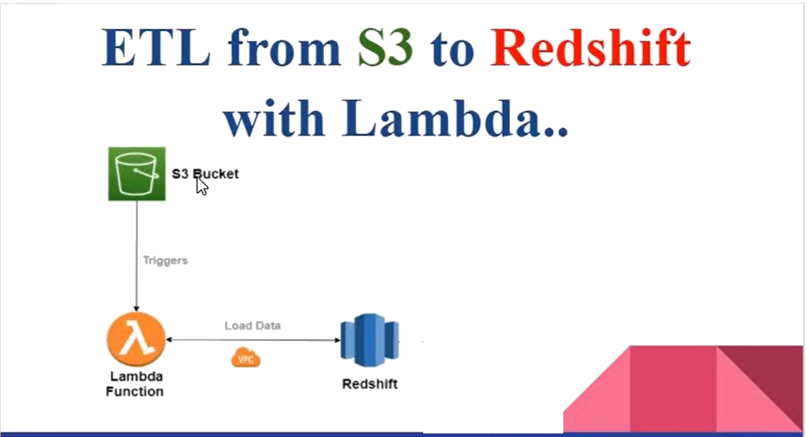

# AWS Lambda Function Sync Data from S3 to Redshift

Data Flow:

## Step By Step

1. Make sure AWS S3 bucket and file is ready

2. go to AWS Lambda -> Create Function

3. config S3 bucket to add a notification event

   
4. Add a Triger in Lambda 

5. Config Lambda VPC to set same VPC with Redshift

6. add Lambda Layer for setting python environment 

